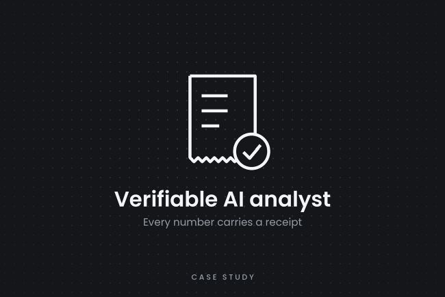
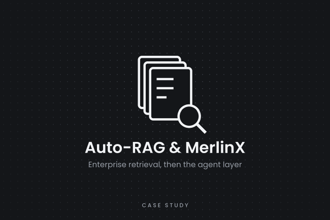
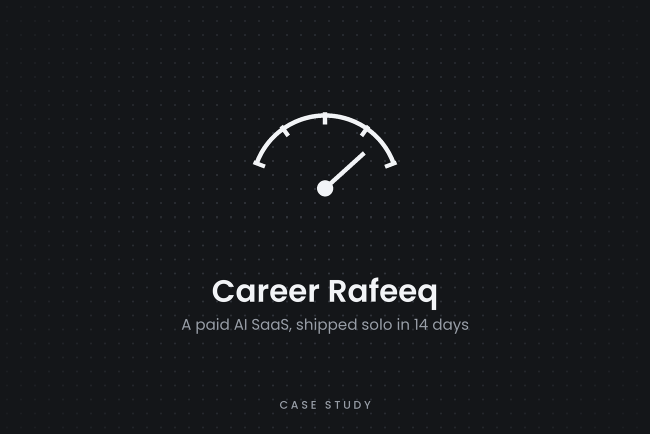

<a href="https://eslamhamed.com"><picture><source media="(prefers-color-scheme: dark)" srcset="assets/banner-dark.svg"></picture></a>

<a href="https://eslamhamed.com/hire"><picture><source media="(prefers-color-scheme: dark)" srcset="assets/pill-available-dark.svg"></picture></a>
<a href="https://eslamhamed.com"><picture><source media="(prefers-color-scheme: dark)" srcset="assets/pill-site-dark.svg"></picture></a>
<a href="https://linkedin.com/in/eslamhamed93"><picture><source media="(prefers-color-scheme: dark)" srcset="assets/pill-linkedin-dark.svg"></picture></a>
<a href="mailto:eslam1311@outlook.com"><picture><source media="(prefers-color-scheme: dark)" srcset="assets/pill-email-dark.svg"></picture></a>

## About

I've spent 10+ years in software engineering, working across **Python, TypeScript and C#/.NET**, and I ship cloud-native AI platforms on **AWS and Azure**.

I've shipped production AI to enterprise customers, including **Gulf-region government ministries**. I formally led a 5-person cross-functional team through a startup's growth phase, and I ship full-stack products solo. Right now I'm focused on production **agentic AI**, **RAG at scale**, **LLMOps**, and AI-assisted engineering done with real discipline.

## Selected work

<table>
<tr>
<td width="33%" valign="top">

<b><a href="https://eslamhamed.com/work/verifiable-ai-analyst">Verifiable AI analyst</a></b>

Every number carries a receipt. Executives ask in plain language. The model decides what to ask, a deterministic engine does the math, and any claim without a receipt is rejected. Solo build, 2026.

</td>
<td width="33%" valign="top">

<b><a href="https://eslamhamed.com/work/auto-rag-merlinx">Auto-RAG and MerlinX</a></b>

At DXWand: enterprise retrieval in production for 7-10 customers, then the agentic SaaS on top of it. Cut LLM cost per conversation by 73% across 840 agents, proven on a frozen suite at 95% confidence before rollout.

</td>
<td width="33%" valign="top">

<b><a href="https://eslamhamed.com/work/career-rafeeq">Career Rafeeq</a></b>

A paid AI SaaS I built and run solo. A statistical eval harness gates every prompt change, and 53 integration test files gate every deploy. Live at <a href="https://careerrafeeq.com">careerrafeeq.com</a>.

</td>
</tr>
</table>

**Open source:** [agentic-methodology](https://github.com/Eslam93/agentic-methodology) - the Claude Code harness I built the analyst with. Rules, skills, hooks and evidence-dated facts, derived from real installations.

## Earlier work worth knowing about

- **Egyptian Ministry of Justice** - real-time speech-to-text with speaker identification for the court system, selected by the Minister and deployed across several dozen courtrooms.
- **Egyptian Cabinet IDSC** - semantic legislation search, delivered as prime vendor from pre-sale through handoff.
- **Cogent** - an Arabic-dialect NLP chatbot SaaS that handled 100K+ monthly sessions at 91% intent accuracy (since retired).

## What I do

- **AI and LLM systems** - production RAG, multi-agent systems with tool calling, orchestration with LangGraph, LangChain and LlamaIndex, MCP tool gateways.
- **AI operations and safety** - LLMOps, evaluation harnesses, guardrails, verifiable-evidence architectures, human-in-the-loop review.
- **Cloud-native backends** - services in Python, TypeScript and C#/.NET; microservices, event-driven and serverless on AWS and Azure; release engineering and repository governance at estate scale.
- **Full-stack, solo** - strict TypeScript with React or Svelte, owning a product end to end.
- **Engineering leadership** - team management, hiring, mentoring, architecture and code review, engineering standards.

## Stack

<table>
<tr>
<td><b>Code</b></td>
<td><picture><source media="(prefers-color-scheme: dark)" srcset="assets/stack-code-dark.svg"></picture></td>
</tr>
<tr>
<td><b>Cloud</b></td>
<td><picture><source media="(prefers-color-scheme: dark)" srcset="assets/stack-cloud-dark.svg"></picture> AWS: EKS, Bedrock, CDK, Lambda &nbsp;|&nbsp; Azure: AKS, Functions, Service Bus, Azure DevOps</td>
</tr>
<tr>
<td><b>Data</b></td>
<td><picture><source media="(prefers-color-scheme: dark)" srcset="assets/stack-data-dark.svg"></picture> Also SQL Server and Cosmos DB</td>
</tr>
<tr>
<td><b>AI</b></td>
<td><picture><source media="(prefers-color-scheme: dark)" srcset="assets/stack-ai-dark.svg"></picture> LangChain, LangGraph, MCP, Neo4j, Temporal and n8n, plus LlamaIndex, Weaviate and Azure AI Search</td>
</tr>
<tr>
<td><b>Builds with</b></td>
<td><picture><source media="(prefers-color-scheme: dark)" srcset="assets/stack-aidev-dark.svg"></picture> Claude Code, Codex and GitHub Copilot, every day</td>
</tr>
</table>

Based in Cairo, working remotely &nbsp;|&nbsp; Arabic (native), English (full professional) &nbsp;|&nbsp; B.Sc. Computer Science, Helwan University

